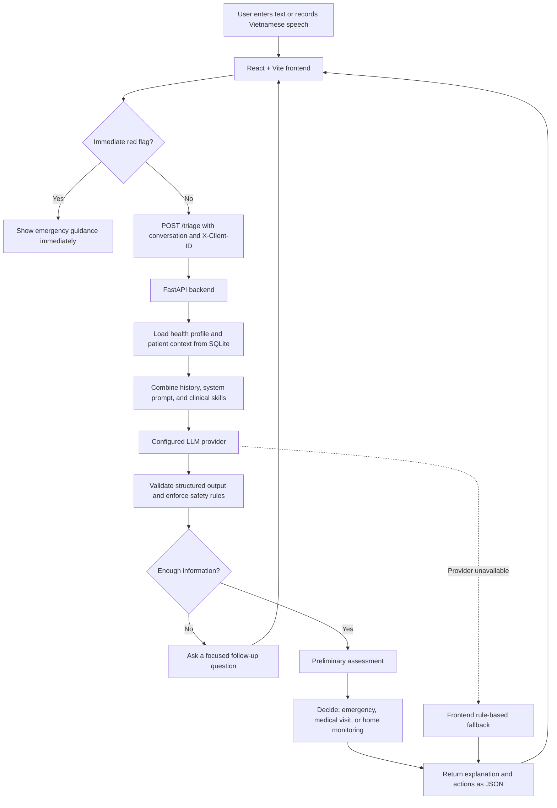

# Yên — AI-Assisted Health Triage

## System Pipeline



Yên is a conversational health-triage assistant designed for Vietnamese users. It collects symptoms in natural language, considers the patient's context, asks focused follow-up questions, and returns a **preliminary assessment**, a triage level, and practical next steps.

Yên does not claim to provide a definitive medical diagnosis. It helps users decide whether a situation may require emergency care, a medical visit, or home monitoring.

## Key Features

- Vietnamese conversational symptom collection.
- Preliminary assessment without presenting a definitive disease diagnosis.
- Immediate client-side red-flag detection before waiting for an LLM response.
- Focused follow-up questions before the first non-emergency conclusion.
- First-person and third-person patient context, such as a parent asking about a child.
- Extraction of age, gender, symptoms, medical conditions, allergies, and medications.
- Anonymous browser sessions with no login or registration screen.
- Persistent profiles, calendars, appointments, and cycle tracking in SQLite.
- Vietnamese speech-to-text input and text-to-speech output.
- Doctor search, schedule lookup, appointment booking, and optional email confirmation.
- Configurable OpenAI, Groq, Gemini, Anthropic, and OpenRouter providers.
- A local rule-based fallback when the remote AI service is unavailable.

## How It Works

1. The frontend generates an anonymous `X-Client-ID` and stores it in `localStorage`.
2. The user describes a health concern through text or recorded speech.
3. React checks for emergency red flags locally to avoid delaying urgent warnings.
4. For non-emergency cases, React sends the message, conversation history, session ID, and client ID to FastAPI.
5. FastAPI loads the relevant health profile from SQLite and builds the patient context.
6. The LLM extracts relevant details and asks for missing information when necessary.
7. The backend validates the structured response and enforces pacing, context, and safety rules.
8. React displays the preliminary assessment, reasoning, triage level, recommended actions, and whether a medical visit is needed.

## Technology Stack

| Layer | Technology |
|---|---|
| Frontend | React 18, Vite 5, React Router 7, Framer Motion |
| Backend | FastAPI, Uvicorn, Python |
| Database | SQLite through Python's standard `sqlite3` module; no ORM |
| AI | Configurable OpenAI-compatible and native model providers |
| Memory | In-memory conversation state, FAISS, and sentence-transformer embeddings |
| Speech | Browser audio recording, Vietnamese speech recognition, and gTTS |
| Session identity | Anonymous `X-Client-ID` stored in browser `localStorage` |

## Repository Structure

```text
VHO/
├── README.md
└── Yen/
    ├── frontend/
    │   ├── src/
    │   │   ├── App.jsx                    # Application routes
    │   │   ├── context/SessionContext.jsx # Anonymous session and profile state
    │   │   ├── lib/
    │   │   │   ├── api.js                 # FastAPI client
    │   │   │   ├── audioRecorder.js       # Browser audio recording
    │   │   │   ├── liveSpeechRecognition.js
    │   │   │   └── triageEngine.js        # Red flags and rule-based fallback
    │   │   ├── pages/                      # Landing, chat, profile, calendar, booking
    │   │   └── components/                 # Shared UI and triage components
    │   ├── package.json
    │   └── vite.config.js
    ├── backend/
    │   ├── server.py                       # FastAPI routes and triage orchestration
    │   ├── db.py                           # SQLite schema and data access
    │   ├── chat.py                         # LLM tool loop and transcripts
    │   ├── memory.py                       # Conversation memory and retrieval
    │   ├── providers/                      # Supported LLM providers
    │   ├── artifacts/
    │   │   ├── system_prompt.md            # LLM behavior and output contract
    │   │   └── skills/                     # Domain-specific instructions
    │   ├── stt/                            # Speech-to-text service
    │   ├── data/app.db                     # Runtime SQLite database; gitignored
    │   ├── .env.example
    │   └── requirements.txt
    └── docs/
        └── Yen_Project_Report.html
```

## Local Setup

### Prerequisites

- Python 3.10 or newer
- Node.js 18 or newer
- npm
- An API key for a supported provider if live AI responses are required

### 1. Install and configure the backend

```bash
cd Yen/backend
pip install -r requirements.txt
cp .env.example .env
```

On Windows PowerShell, use `Copy-Item .env.example .env` instead of `cp`.

Example OpenAI configuration in `Yen/backend/.env`:

```env
OPENAI_API_KEY=your-api-key
TRIAGE_PROVIDER=openai
TRIAGE_MODEL=gpt-4o-mini
TRIAGE_MIN_FOLLOWUP_QUESTIONS=2
```

Never commit `.env` or expose API keys in source code.

### 2. Install and configure the frontend

```bash
cd ../frontend
npm install
```

Create `Yen/frontend/.env.local`:

```env
VITE_API_BASE_URL=http://localhost:8787
```

Without `VITE_API_BASE_URL`, the chat uses the local rule-based engine rather than the backend LLM flow.

### 3. Start the application

From `Yen/frontend`:

```bash
npm run dev:all
```

This starts:

- FastAPI at `http://localhost:8787`
- React at `http://localhost:5173`

Open `http://localhost:5173` and select **Chat with Yên**. No login is required.

To run the services separately:

```bash
# Terminal 1
cd Yen/backend
python -X utf8 server.py

# Terminal 2
cd Yen/frontend
npm run dev
```

## REST API

The REST API connects user actions in React to backend processing, AI providers, and SQLite.

| Method and route | Purpose |
|---|---|
| `GET /health` | Check backend and configured provider status |
| `POST /triage` | Process a conversation turn with patient context |
| `POST /triage/end` | End a triage session |
| `GET /profile` | Read an anonymous user's health profile |
| `PUT /profile` | Update the health profile |
| `GET/POST/DELETE /calendar` | Manage health-calendar entries |
| `GET/POST/DELETE /cycle` | Manage cycle entries and predictions |
| `GET /doctors` | Search doctors by query, campus, specialty, or time |
| `GET /doctors/{doctor_id}/schedule` | Read a doctor's available schedule |
| `POST /doctors/{doctor_id}/book` | Book an appointment |
| `POST /stt/transcribe` | Convert recorded WAV audio to Vietnamese text |
| `POST /tts` | Convert assistant text to audio |

Requests associated with personal data include the browser-generated `X-Client-ID` header.

## Anonymous Sessions and SQLite

Yên has no active login or registration flow. The frontend generates a random client ID and keeps it in the browser. FastAPI uses that ID to separate profiles and calendar data between browser installations.

SQLite stores anonymous user records, health profiles, calendar entries, appointments, and menstrual-cycle entries. The runtime database is located at `Yen/backend/data/app.db` and is excluded from Git.

Clearing the browser's site data creates a new client ID, so that browser will no longer be associated with its previous anonymous profile.

## Triage Behavior

For non-emergency cases, the assistant follows this order:

```text
Collect patient context
    → ask focused follow-up questions
    → provide a cautious preliminary assessment
    → decide whether medical care is needed
    → explain next actions and warning signs
```

For example, when a parent asks about a 14-year-old son experiencing isolated wet dreams, the assistant checks for pain, swelling, fever, urinary symptoms, blood, and daily-life impact. If no warning signs are present, it may describe the situation as likely consistent with normal puberty physiology and recommend home monitoring. It does not present a definitive disease diagnosis.

Emergency cases bypass the normal follow-up flow and immediately display urgent guidance.

## Speech Input

In the chat composer, select the microphone button, allow browser microphone access, speak for up to 30 seconds, and select the button again to stop.

- Chrome and Edge can display an interim transcript while the user is speaking.
- After recording stops, the backend processes the WAV audio and returns the final transcript.
- Browsers without live recognition can still use backend transcription after recording.
- Microphone access requires `localhost` or an HTTPS deployment.

## Appointment Email

The backend can send an email after a successful appointment booking. Configure the SMTP variables in `Yen/backend/.env`:

```env
SMTP_HOST=smtp.gmail.com
SMTP_PORT=587
SMTP_USERNAME=your-email@gmail.com
SMTP_PASSWORD=your-app-password
SMTP_FROM_EMAIL=your-email@gmail.com
SMTP_FROM_NAME=Yên Health
SMTP_USE_TLS=true
SMTP_USE_SSL=false
```

For Gmail, use a Google App Password instead of the account login password. If email delivery fails, the appointment remains stored and the API reports the notification status separately.

## Build and Verification

Build the frontend:

```bash
cd Yen/frontend
npm run build
```

Run the backend regression tests:

```bash
cd Yen/backend
python -X utf8 -m unittest -v test_patient_context.py test_triage_pacing.py test_preliminary_assessment.py
```

## Production Notes

- SQLite is suitable for a single-instance prototype, but not for a multi-replica production deployment.
- An SQLite file can be lost on ephemeral hosting during redeployment. Use persistent storage or migrate to PostgreSQL for production.
- Store API and SMTP keys in environment variables or a secret manager.
- Configure `CORS_ORIGINS` for the deployed frontend domain.
- Yên is a decision-support prototype and is not a substitute for professional medical evaluation.

## Project Report

The detailed project report is available at [`Yen/docs/Yen_Project_Report.html`](Yen/docs/Yen_Project_Report.html).

## AI Development Log

Development-assistance records are available in [`Yen/AI_LOG.md`](Yen/AI_LOG.md).
